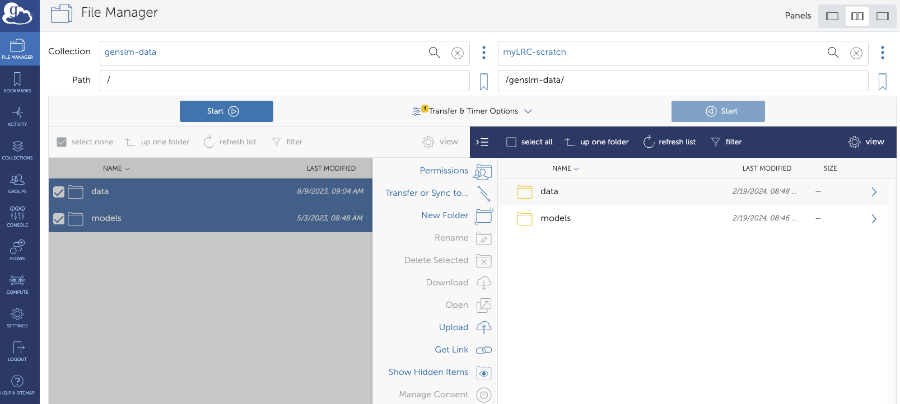

# Run GenSLMs on Lawrencium GPU Cluster 
forked from [GenSLMs](https://github.com/ramanathanlab/genslm/tree/main)

## GenSLMs: Genome-scale language models reveal SARS-CoV-2 evolutionary dynamics
Available here: https://www.biorxiv.org/content/10.1101/2022.10.10.511571v2

## Installation

### Request an [Interactive Jupyter Server](https://it.lbl.gov/resource/hpc/for-users/hpc-documentation/open-ondemand/jupyter-server/) on ES1 GPU partition from [Lawrencium Open OnDemand](https://lrc-ondemand.lbl.gov)
* Connect to Jupyter and open a terminal

### Create conda environment and activate
```bash
conda create -n genslm python=3.8
conda activate genslm
```

### Install GenSLM
```bash
pip install git+https://github.com/ramanathanlab/genslm
```

## Usage

### __Download pre-trained models__
__The pre-trained models and datasets need to be downloaded from this [Globus Endpoint](https://app.globus.org/file-manager?origin_id=25918ad0-2a4e-4f37-bcfc-8183b19c3150&origin_path=%2F)__ to Lawrencium cluser scratch space, e.g.: `/global/scratch/users/$USER/genslm-data/`



### Use GenSLMs to compute sequence embeddings for downsteam tasks 

```bash
$ python genslm-embeddings.py

Tokenizing...: 100% 2/2 [00:00<00:00, 80.59it/s]
(2, 512)
```

```python
# genslm-embeddings.py
import torch
import numpy as np
from torch.utils.data import DataLoader
from genslm import GenSLM, SequenceDataset

import os
USER = os.environ.get('USER')

# Load model
# Pre-trained models and datasets need to be downloaded to "/global/scratch/users/$USER/genslm-data/"
model_path = "/global/scratch/users/{}/genslm-data/models/25M/".format(USER)
model = GenSLM("genslm_25M_patric", model_cache_dir=model_path)

model.eval()

# Select GPU device if it is available, else use CPU
device = "cuda" if torch.cuda.is_available() else "cpu"
model.to(device)

# Input data is a list of gene sequences
sequences = [
    "ATGAAAGTAACCGTTGTTGGAGCAGGTGCAGTTGGTGCAAGTTGCGCAGAATATATTGCA",
    "ATTAAAGATTTCGCATCTGAAGTTGTTTTGTTAGACATTAAAGAAGGTTATGCCGAAGGT",
]

dataset = SequenceDataset(sequences, model.seq_length, model.tokenizer)
dataloader = DataLoader(dataset)

# Compute averaged-embeddings for each input sequence
embeddings = []
with torch.no_grad():
    for batch in dataloader:
        outputs = model(batch["input_ids"].to(device), batch["attention_mask"].to(device), output_hidden_states=True)
        # outputs.hidden_states shape: (layers, batch_size, sequence_length, hidden_size)
        # Use the embeddings of the last layer
        emb = outputs.hidden_states[-1].detach().cpu().numpy()
        # Compute average over sequence length
        emb = np.mean(emb, axis=1)
        embeddings.append(emb)

# Concatenate embeddings into an array of shape (num_sequences, hidden_size)
embeddings = np.concatenate(embeddings)
print(embeddings.shape)
```

### Use GenSLMs to generate synthetic sequences

```bash
$  python genslm-generate.py 

ATG CCA CAG ATT CTG CGC GTC GCC CTC GTG
ATG CCT GCT AAA ATA TAC TTA AAC ATG AGC
```


```python
# genslm-generate.py 
import torch
import numpy as np
from torch.utils.data import DataLoader
from genslm import GenSLM, SequenceDataset

import os
USER = os.environ.get('USER')

# Load model
# Pre-trained models and datasets need to be downloaded to "/global/scratch/users/$USER/genslm-data/"
model_path = "/global/scratch/users/{}/genslm-data/models/25M/".format(USER)
model = GenSLM("genslm_25M_patric", model_cache_dir=model_path)

model.eval()

# Select GPU device if it is available, else use CPU
device = "cuda" if torch.cuda.is_available() else "cpu"
model.to(device)

# Prompt the language model with a start codon
prompt = model.tokenizer.encode("ATG", return_tensors="pt").to(device)

tokens = model.model.generate(
    prompt,
    max_length=10,  # Increase this to generate longer sequences
    min_length=10,
    do_sample=True,
    top_k=50,
    top_p=0.95,
    num_return_sequences=2,  # Change the number of sequences to generate
    remove_invalid_values=True,
    use_cache=True,
    pad_token_id=model.tokenizer.encode("[PAD]")[0],
    temperature=1.0,
)

sequences = model.tokenizer.batch_decode(tokens, skip_special_tokens=True)

for sequence in sequences:
    print(sequence)
```
